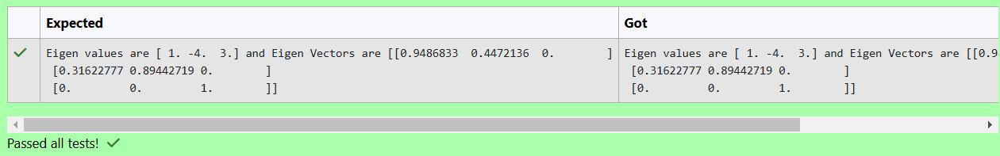

# EIGENVALUES-AND-EIGENVECTORS
## Aim:
To write a python program to find the Eigenvalues and Eigen Vectors
## Equipment’s required:
1. 	Hardware – PCs
2. 	Anaconda – Python 3.7 Installation / Moodle-Code Runner
## Algorithm:
### Step1 : import  numpy as py
### Step 2: get input from user
### Step 3: Using the np.linalg.eig(),  we get two results (first is eigenvalue and second is eigenvector) of the given matrix.
### Step 4: print op

## Program:

#Program to find the eigen values and eigen vectors.

#Developed by: SHREEDHAR KUMAR K.J

#RegisterNumber: 24901118
```
import numpy as np
A=np.array([[2,-3,0],[2,-5,0],[0,0,3]])
e_va,e_ve=np.linalg.eig(A)
print(f"Eigen values are {e_va} and Eigen Vectors are {e_ve}")
```
## Output:
## Result:
Thus the Eigenvalue and Eigenvector is successfully solved using python program
